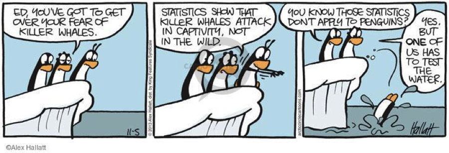
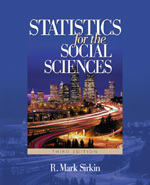

## Course Information: Sociology 303

Instructor        | Sherri Ann Verdugo, M.S.
------------------|-------------------------------------
Soc 303–03 15668  | Room: H512 
                  | Mon. & Wed. 2:30 – 3:45PM
Office: CP-923    | Hours: Wednesday 1:00 - 2:00PM
Phone             | 657.278.6728
Soc 303–85 16584  | Room: IRVC-203 
                  | Friday 1:00 – 3:45PM 
Office:           | Hours: Friday 11:00 - 12:00PM

--- .class #id

## Introduction

The only time a pie chart is appropriate is at a baker's convention.

--- .class #id 

## Administration Items

Each presentation you will find that we cover a few topics that are required by CSUF. Welcome to the Fall 2014 semester where you are going to enjoy and learn about statistical methods. 

* Introduction
* Textbook
* Course Description
* Syllabus
* Surviving Statistics
* Expectations
* Class Organization
* Overview of course

--- .class #id

## Textbook

Item             | Description
-----------------|-------------------------------------
Textbook Options | Required
ISBN             | 9781412905466
Book Title       | Statistics for the social sciences
Author           | R. Mark Sirkin.
Publisher        | Thousand Oaks, Calif. : Sage Publications, 2006
Edition          | 3rd ed.

--- .class #id

## Course Description

* SOCI 303 Statistics for the Social Sciences

*Description*: Prerequisites: completion of G. E. Categories III.A.1 and III.C.1. Techniques for the elementary statistical analysis of social data. Description and inferential measures include tests, chi-square, analysis of variance, contingency table analysis and linear regression.
Units: (3)

This class is not difficult, but you will be required to retain the information you learn. Take notes, ask questions, inquire. This is the learning process so you will need to recall math concepts. If enough people are interested, I will run a math review boot camp during the second week during office hours. In addition, I will provide extra notes for math concepts that will be key in our class.

--- .class #id

## Syllabus 

Let's take a few minutes to go over the syllabus and expectations for the class. 

<iframe src = 'Syllabus_verdu303.pdf' height='600px'></iframe>

--- .class #id

## Surviving Statistics

Statistics is a method based class. Meaning that you will learn methods that will carry you through to the next topic. This semester will build on top of knowledge you already know and will learn. If you are stuck, confused, or you want to talk about statistics, I encourage you to come to my office.

* Statistics is defined as: a set of methods where one wants to infer facts about a population using _noisy_ statistical data where uncertainty must be accounted for.

* Motivations: 
  * Elections (who will win an election...prediction)
  * Clinical research (will a certain medication perform better?)
  * Does the weight of a car impact the mpg of the car?
  * Hypothesis testing...using evidence based methods!

--- .class #id

## When things go wrong with research

* Can things go wrong:
  * Hormone replacement therapy study in 2002 stopped for negative events.
  * Newborns and extra corporeal membrane oxygenation treatment (ECMOs)... sample sized based criticism.
  
* How to avoid things going "wrong"...
  * Reproducible research
  * Documentation
  * Following procedures
  * Correct interpretation

--- .class #id

## Expectations

* Overview of the field of statistics
* Provide an overview of the scientific method
* Statistical reasoning learned from observations
* Techniques for dealing with uncertainties in drawing conclusions
* Making sense of data
* Familiarity with SPSS 

Over the course, you will find that some topics may be more difficult than others. Just remember to look back at your notes because a missing step can often lead to the wrong answer.

--- .class #id

## Class Organization

Chapter  |  Title                   | Topic
---------|--------------------------|-------
Ch. 1    | How we reason            | Scientific Method
Ch. 2    | Levels of Measurement    | NOIR
Ch. 3    | Defining Variables       | Operational Definitions
Ch. 4    | Central Tendency         | Mean, Median, Mode
Ch. 5    | Measuring Dispersion     | Range, Variance, St. Deviation
Ch. 6    | Contingency Tables       | Construction, Regrouping
Ch. 7    | Statistical Inference    | Tests of Significance
Ch. 8    | Probability Distributions| z test & t test
Ch. 9    | Two Sample t-test        | Independent vs. Dependent
Ch. 10   | One-Way ANOVA            | Analysis of Variance
Ch. 11   | Measuring Association    | Interpreting Association
Ch. 12   | Chi-Square               | Tests for Contingency
Misc. 1  | Correlation              | Does not imply causation
Misc. 2  | Regression               | Prediction

--- .class #id

## Overview of course

Each week we will be dividing our time between lecture and hands on experience. Check the course websites for more information.

Item              | Points Possible    
------------------|---------------------
Attendance        | 100 Points (based on rosters)
Participation     | 50 Points 
Homework          | 100 Points
                  | 5 assignments @ 20 points each
Exams             | 300 points
                  | 2 exams @ 150 points each
Writing Assignment| 150 points 2 components
                  | Draft 75 Points
                  | Final 75 Points

Total Points available: 
`Points: 100 + 50 + 100 + 300 + 150 = 700`

Please make sure you check the course website for deadlines and other course information. 

--- .class #id

## Questions

You can reach me at: sverdugo@fullerton.edu

Phone: 657.278.6728
